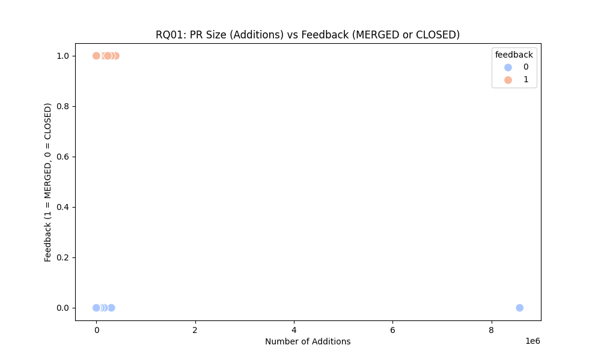
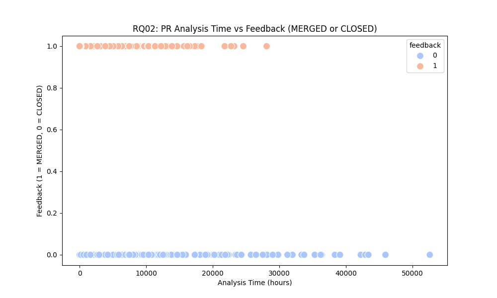
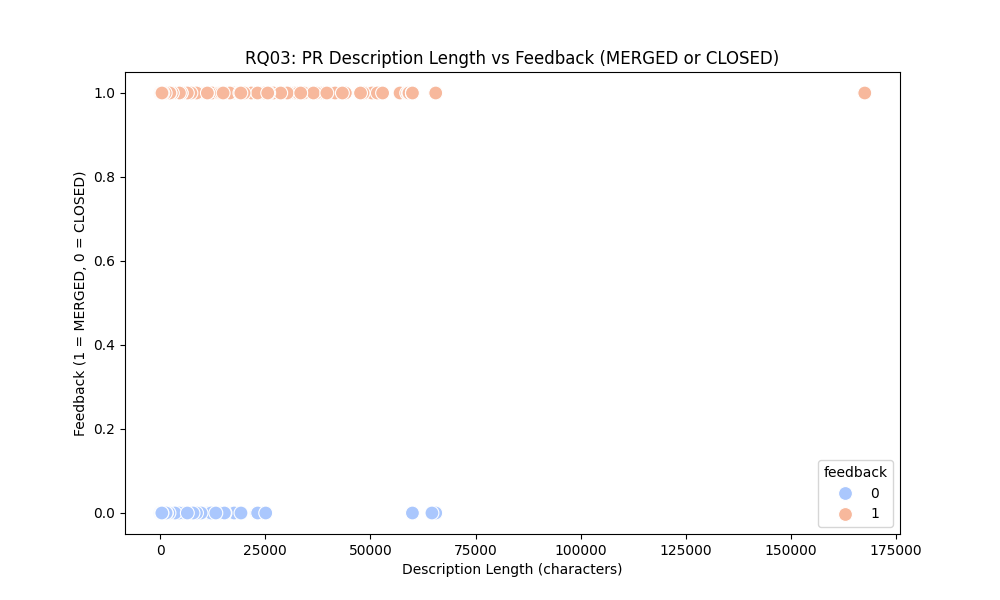
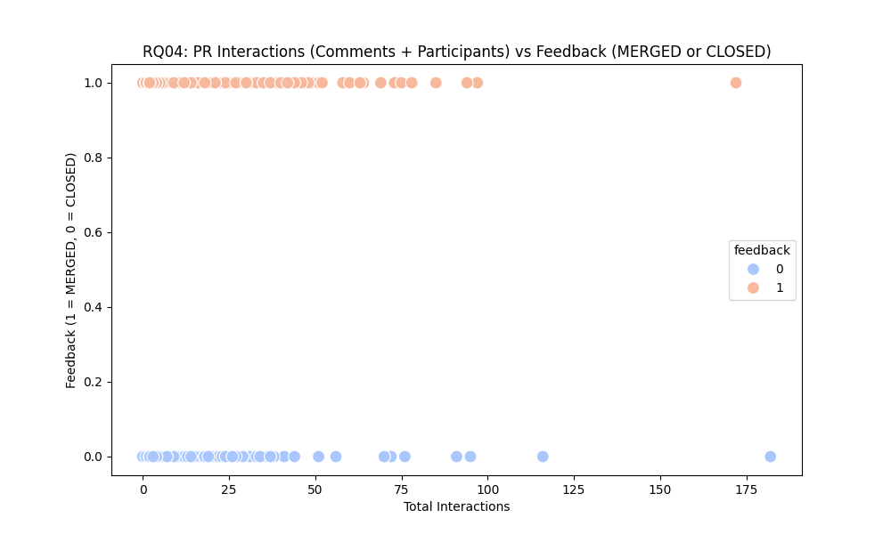
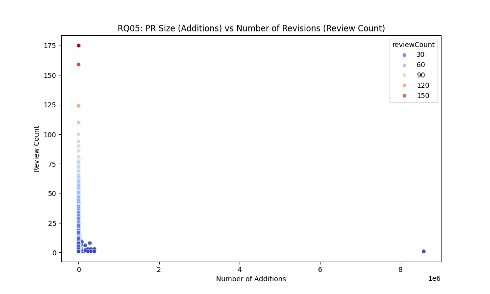
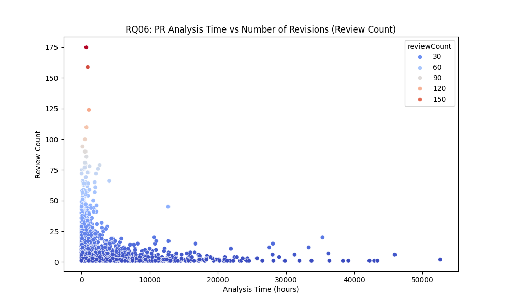
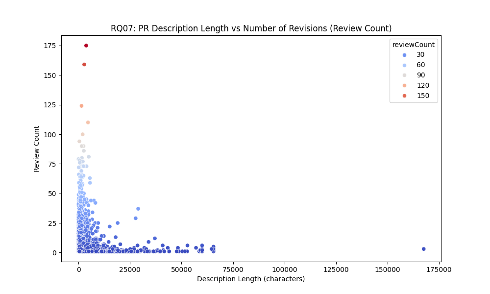
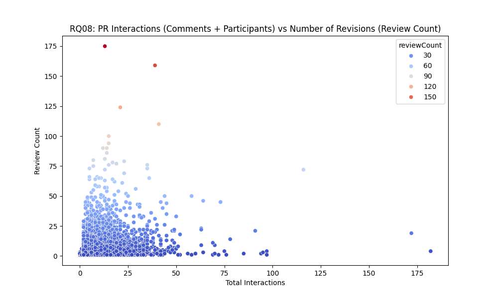

# Lab 03

Integrantes:

- Fernando Couto
- Tito Chen
- Vinicius Lima

## Introdução

**Objetivo**: O objetivo deste trabalho é analisar a relação entre características dos pull requests (PRs) no GitHub, como tamanho, tempo de análise, descrição e interações, e seu impacto no feedback recebido, medido pelo estado do PR e no número de revisões realizadas.

**Linguagem de programação**: Python 3

**Dependências**:
- pandas
- matplotlib
- numpy
- seaborn
- requests

**API utilizada**: GitHub GraphQL API

## Hipóteses informais

- **RQ01**: Em relação ao tamanho dos PRs e o feedback recebido, é possível supor que PRs maiores (com mais adições) possam levar a uma maior chance de serem fechados (CLOSED), já que tamanhos maiores podem aumentar a complexidade e o risco de erros. Entretanto, PRs menores tendem a ser mais facilmente revisados e aceitos (MERGED), pois sua simplicidade facilita a revisão e aprovação.

- **RQ02**: Para o tempo de análise dos PRs e seu estado final (MERGED ou CLOSED), pode-se supor que PRs que passam mais tempo em análise têm maior chance de serem fechados (CLOSED), já que tempos de análise longos podem indicar dificuldades na revisão ou na aceitação das mudanças propostas. PRs que são mergeados (MERGED) mais rapidamente podem ser mais simples ou menos problemáticos, resultando em um tempo de revisão menor.

- **RQ03**: Descrições mais longas podem estar associadas a um aumento da chance de um PR ser mergeado (MERGED), pois uma comunicação clara e detalhada tende a reduzir ambiguidades e facilitar a compreensão do conteúdo do PR. PRs com descrições curtas podem ser mais propensos a serem fechados (CLOSED) devido à falta de clareza ou de informações suficientes.

- **RQ04**: PRs que envolvem mais interações (como comentários e participação de diferentes usuários) podem ter maior probabilidade de serem mergeados (MERGED). A comunicação ativa entre colaboradores pode ajudar a esclarecer dúvidas, resolver problemas e melhorar a qualidade do PR. Em contrapartida, PRs com menos interações podem ser mais propensos a serem fechados (CLOSED), pois podem indicar menos engajamento da equipe ou falta de colaboração para resolver as questões levantadas.

- **RQ05**: PRs menores tendem a receber mais revisões, pois, apesar de simples, eles podem ser revisados de forma mais rápida e detalhada. Já PRs maiores podem ter menos revisões, pois a complexidade pode desencorajar revisões detalhadas em todas as partes do código.

- **RQ06**: PRs que passam mais tempo em análise tendem a receber menos revisões, possivelmente porque o tempo prolongado pode indicar que os revisores não têm tempo suficiente para revisar profundamente, ou que o PR é muito complexo para ser revisado em detalhes.

- **RQ07**: PRs com descrições mais longas tendem a receber menos revisões, uma vez que uma descrição bem detalhada pode reduzir a necessidade de feedback adicional. Já PRs com descrições curtas ou insuficientes podem necessitar de mais revisões para clarificar os pontos mal explicados.

- **RQ08**: PRs com mais interações (comentários e participantes) tendem a receber mais revisões, pois a comunicação ativa pode levar a múltiplas iterações e melhorias no código. Em contrapartida, PRs com menos interações geralmente concentram-se no quadrante inferior esquerdo, indicando uma revisão mais superficial e poucas mudanças iterativas.

## Metodologia

Para a análise dos pull requests (PRs) e a investigação das questões de pesquisa (RQ01 a RQ08), foi adotada uma abordagem quantitativa baseada em dados obtidos de repositórios do GitHub. A metodologia foi dividida em várias etapas principais, detalhadas a seguir:

### 1. **Coleta de Dados**
Os dados foram coletados a partir de repositórios de código-fonte hospedados no GitHub. Utilizamos a API do GitHub GraphQL para extrair informações sobre PRs, incluindo:
- Estado do PR (MERGED ou CLOSED)
- Número de adições e deleções
- Tempo de análise (duração entre a criação e o fechamento/merge do PR)
- Número de revisões
- Tamanho da descrição do PR
- Número de participantes e comentários
- Total de interações

Esses dados permitiram a construção de um conjunto de dados consolidado para análise.

### 2. **Estruturação e Limpeza dos Dados**
Os dados extraídos foram processados e estruturados em formato JSON. Posteriormente, os dados foram convertidos para um **DataFrame** utilizando a biblioteca **pandas**. Durante o processamento, alguns passos importantes foram realizados:
- Conversão de strings de datas para objetos datetime.
- Cálculo da **duração de análise do PR**, considerando a diferença entre o horário de criação e fechamento/merge do PR.
- Cálculo do número total de **interações** como a soma de comentários e participantes.
- Garantia de que os PRs possuíam as informações necessárias para o estudo, removendo dados incompletos.

### 3. **Definição das Questões de Pesquisa**
Com o objetivo de explorar como as características dos PRs se relacionam com o feedback e o número de revisões, definimos as seguintes questões de pesquisa (RQs):
- **RQ01**: Qual é a relação entre o tamanho do PR (adições) e o feedback recebido (MERGED ou CLOSED)?
- **RQ02**: Qual é a relação entre o tempo de análise de um PR e o feedback recebido?
- **RQ03**: Qual é a relação entre o tamanho da descrição do PR e o feedback recebido?
- **RQ04**: Como o número de interações (comentários e participantes) impacta o feedback do PR?
- **RQ05**: Qual é a relação entre o tamanho do PR e o número de revisões?
- **RQ06**: O tempo de análise do PR influencia o número de revisões?
- **RQ07**: O tamanho da descrição impacta o número de revisões?
- **RQ08**: Como o número de interações influencia o número de revisões?

### 4. **Análise de Dados e Visualização**
Utilizamos técnicas de visualização de dados para responder às questões de pesquisa, utilizando **seaborn** e **matplotlib** para gerar gráficos de dispersão que permitissem identificar padrões e tendências. As visualizações foram feitas para cada RQ, utilizando as seguintes variáveis:
- **Tamanho do PR**: número de adições.
- **Tempo de Análise**: duração do PR em horas.
- **Tamanho da Descrição**: número de caracteres da descrição do PR.
- **Número de Interações**: soma de comentários e participantes.
- **Feedback**: estado do PR (MERGED ou CLOSED).
- **Número de Revisões**: número de revisões que o PR passou.

Cada gráfico gerado foi salvo em formato de imagem e revisado individualmente para a interpretação dos resultados.

### 5. **Interpretação dos Resultados**
Os gráficos gerados foram utilizados para identificar correlações e tendências entre as variáveis, comparando os resultados com as hipóteses iniciais. A análise levou em conta:
- A distribuição de PRs entre os estados MERGED e CLOSED para as questões de feedback (RQ01-RQ04).
- A relação entre as variáveis do PR (tamanho, tempo de análise, descrição, interações) e o número de revisões (RQ05-RQ08).

### 6. **Ferramentas e Bibliotecas Utilizadas**
- **Python**: Linguagem de programação utilizada para manipulação e análise dos dados.
- **pandas**: Biblioteca para processamento e análise de dados.
- **matplotlib** e **seaborn**: Bibliotecas para geração de gráficos e visualizações.
- **GitHub GraphQL API**: Utilizada para a extração dos dados dos repositórios.

Essa abordagem metodológica permitiu uma análise sistemática e baseada em dados das relações entre os aspectos dos PRs e o feedback/número de revisões recebidos, resultando em insights sobre práticas de desenvolvimento colaborativo.

## Resultados

### RQ01: Tamanho do PR (Adições) vs Feedback (MERGED ou CLOSED)

O gráfico mostra uma distribuição semelhante entre o número de pull requests fechados (CLOSED) e mergeados (MERGED), independentemente do tamanho do PR em termos de adições.

---

### RQ02: Tempo de Análise vs Feedback (MERGED ou CLOSED)

Pull requests com tempos de análise mais longos tendem a ser fechados (CLOSED) com mais frequência do que mergeados (MERGED), indicando que tempos maiores de revisão podem estar associados a feedback negativo.

---

### RQ03: Comprimento da Descrição vs Feedback (MERGED ou CLOSED)

Observa-se que PRs com descrições entre 25.000 e 60.000 caracteres têm uma maior probabilidade de serem mergeados (MERGED), sugerindo que descrições mais detalhadas podem estar relacionadas a feedback positivo.

---

### RQ04: Interações (Comentários + Participantes) vs Feedback (MERGED ou CLOSED)

Há uma predominância de PRs mergeados (MERGED) em comparação aos fechados (CLOSED), independentemente do número de interações entre comentários e participantes.

---

### RQ05: Tamanho do PR (Adições) vs Número de Revisões (Review Count)

Pull requests com menos adições tendem a receber mais revisões, sugerindo que PRs menores são mais propensos a revisões detalhadas ou frequentes.

---

### RQ06: Tempo de Análise vs Número de Revisões (Review Count)

PRs com tempos de análise maiores apresentam menos revisões, indicando que PRs que demoram mais para serem processados podem não receber tanto feedback detalhado.

---

### RQ07: Comprimento da Descrição vs Número de Revisões (Review Count)

PRs com descrições mais longas tendem a receber menos revisões, possivelmente porque descrições extensas podem reduzir a necessidade de revisões adicionais.

---

### RQ08: Interações (Comentários + Participantes) vs Número de Revisões (Review Count)

Há uma grande concentração de PRs com poucas interações e poucas revisões (localizadas no quadrante inferior esquerdo). Entretanto, há alguns casos destoantes no quadrante superior esquerdo, com muitas revisões, apesar do baixo número de interações.

---

## Discussão

Ao conduzir a análise dos pull requests (PRs), tínhamos algumas expectativas iniciais sobre as relações entre as características dos PRs e o feedback (estado MERGED ou CLOSED) ou o número de revisões recebidas. No entanto, os resultados obtidos a partir dos gráficos trouxeram algumas surpresas e confirmaram ou contradisseram as hipóteses.

### RQ01: Tamanho do PR (adições) vs Feedback (MERGED ou CLOSED)
**Hipótese Inicial**: Acreditava-se que PRs menores teriam maior chance de serem mergeados (MERGED), enquanto PRs maiores, por serem mais complexos, teriam uma maior probabilidade de serem fechados (CLOSED).

**Resultado Obtido**: O gráfico mostrou uma distribuição bastante equilibrada entre PRs fechados e mergeados, sem uma clara correlação entre o tamanho do PR e o feedback. Essa descoberta sugere que o tamanho do PR por si só não é um fator decisivo para determinar se um PR será mergeado ou fechado. Outros fatores, como a qualidade do código ou a clareza da descrição, podem ter um impacto mais significativo.

---

### RQ02: Tempo de análise do PR vs Feedback (MERGED ou CLOSED)
**Hipótese Inicial**: Acreditava-se que PRs com tempos de análise mais longos teriam uma maior probabilidade de serem fechados (CLOSED), enquanto PRs mergeados (MERGED) seriam revisados em menor tempo, já que menos problemas seriam identificados.

**Resultado Obtido**: O gráfico confirmou essa hipótese, mostrando que PRs com tempos de análise mais longos tinham uma maior incidência de fechamentos (CLOSED). PRs mergeados tendiam a ter tempos de análise mais curtos. Isso indica que PRs que ficam em análise por muito tempo podem enfrentar dificuldades que levam ao fechamento, talvez devido à complexidade ou falta de clareza.

---

### RQ03: Tamanho da descrição vs Feedback (MERGED ou CLOSED)
**Hipótese Inicial**: PRs com descrições mais detalhadas seriam mais propensos a serem mergeados, enquanto PRs com descrições curtas seriam mais propensos a serem fechados, devido à falta de clareza ou comunicação.

**Resultado Obtido**: O gráfico apresentou uma concentração de PRs mergeados (MERGED) com descrições de tamanho médio (entre 25.000 e 60.000 caracteres), confirmando parcialmente a hipótese. No entanto, PRs fechados também foram observados em tamanhos de descrição variados. Isso sugere que, embora uma descrição mais detalhada possa contribuir para uma maior probabilidade de sucesso, não é o único fator em jogo. O conteúdo da descrição pode ser mais importante que seu tamanho absoluto.

---

### RQ04: Interações (comentários e participantes) vs Feedback (MERGED ou CLOSED)
**Hipótese Inicial**: PRs com mais interações (comentários e participação) seriam mais propensos a serem mergeados, uma vez que a colaboração ativa pode resolver problemas e melhorar a qualidade do PR.

**Resultado Obtido**: O gráfico mostrou que PRs com mais interações tendem a ser mergeados (MERGED), confirmando a hipótese. Isso reforça a importância da comunicação e colaboração durante o processo de revisão, sugerindo que PRs que envolvem mais pessoas e discussões são mais propensos a encontrar soluções e serem aprovados.

---

### RQ05: Tamanho do PR (adições) vs Número de revisões (reviewCount)
**Hipótese Inicial**: Esperava-se que PRs maiores (com mais adições) tivessem mais revisões, devido à maior complexidade e ao aumento da probabilidade de erros.

**Resultado Obtido**: O gráfico mostrou o oposto do esperado: PRs menores tendem a ter mais revisões. Isso sugere que, embora PRs grandes possam ser mais complexos, os revisores podem não examinar cada detalhe tão cuidadosamente quanto fazem com PRs menores. PRs pequenos, por outro lado, podem ser mais fáceis de revisar completamente, resultando em um maior número de revisões.

---

### RQ06: Tempo de análise do PR vs Número de revisões (reviewCount)
**Hipótese Inicial**: PRs com tempos de análise mais longos teriam mais revisões, já que um maior tempo permitiria uma análise mais aprofundada.

**Resultado Obtido**: A hipótese foi refutada pelos dados. PRs com mais tempo de análise tendem a ter menos revisões, o que pode indicar que PRs mais longos ou complexos se tornam difíceis de revisar completamente, e os revisores podem reduzir o número de revisões ou até desistir de revisá-los de maneira aprofundada.

---

### RQ07: Tamanho da descrição vs Número de revisões (reviewCount)
**Hipótese Inicial**: Descrições mais longas resultariam em menos revisões, pois a clareza da descrição diminuiria a necessidade de feedback adicional.

**Resultado Obtido**: A hipótese foi confirmada, mostrando que PRs com descrições mais longas geralmente recebem menos revisões. Isso indica que uma descrição mais detalhada ajuda a evitar revisões extensivas, possivelmente devido à maior clareza que ela proporciona.

---

### RQ08: Interações (comentários e participantes) vs Número de revisões (reviewCount)
**Hipótese Inicial**: PRs com mais interações (mais comentários e participantes) tenderiam a ter mais revisões, uma vez que a comunicação entre os revisores poderia resultar em várias iterações.

**Resultado Obtido**: O gráfico apresentou uma grande concentração de PRs com poucas interações e revisões, mas alguns PRs com muitas interações realmente tiveram mais revisões, como esperado. Isso sugere que, embora a maioria dos PRs tenha interações e revisões limitadas, aqueles com maior colaboração acabam passando por um processo de revisão mais detalhado e iterativo.

---

## Conclusão

Os resultados da análise reforçam a ideia de que a colaboração (mais interações e comunicação clara) é um fator chave para o sucesso de PRs, resultando em mais PRs mergeados e em menos necessidade de revisões adicionais. Por outro lado, PRs maiores e com tempos de análise mais longos tendem a enfrentar mais dificuldades e a ter menos revisões ou chances de serem aceitos. Essas descobertas sugerem que, para melhorar a taxa de sucesso de PRs, é crucial garantir uma comunicação eficiente e detalhada, além de manter o tamanho do PR e o tempo de análise dentro de limites gerenciáveis.
